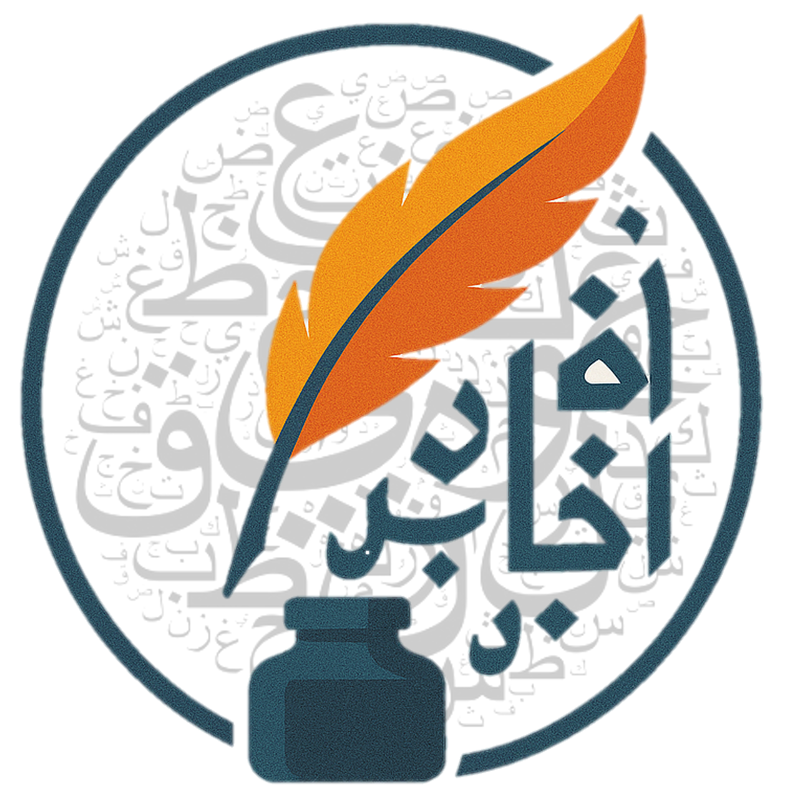
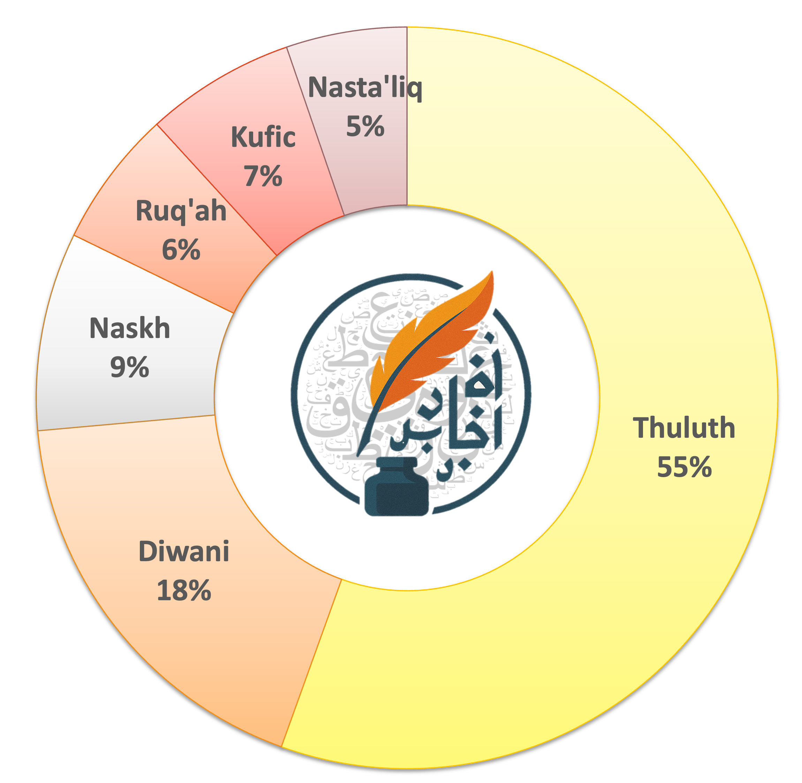
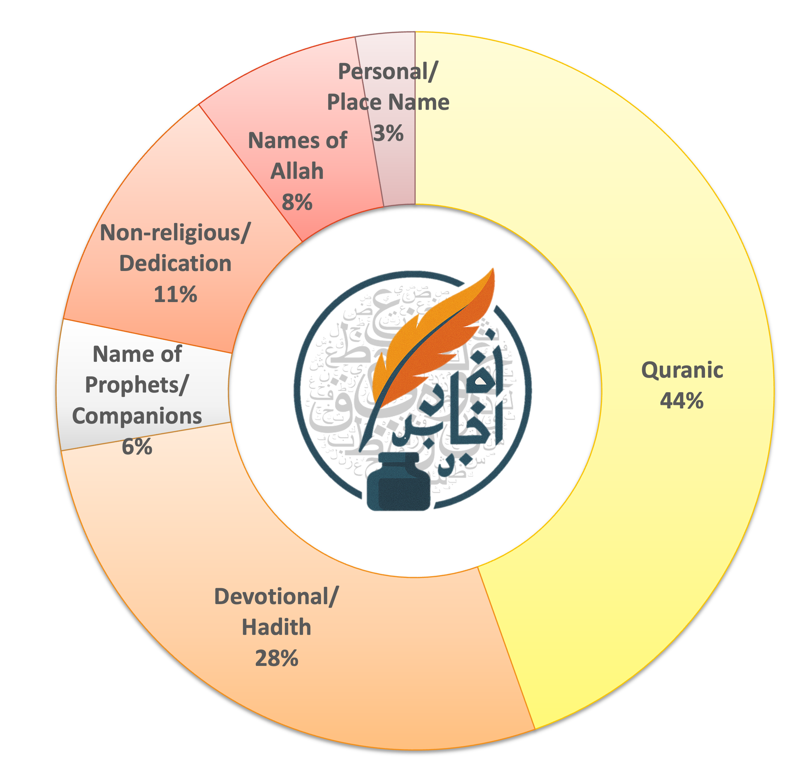
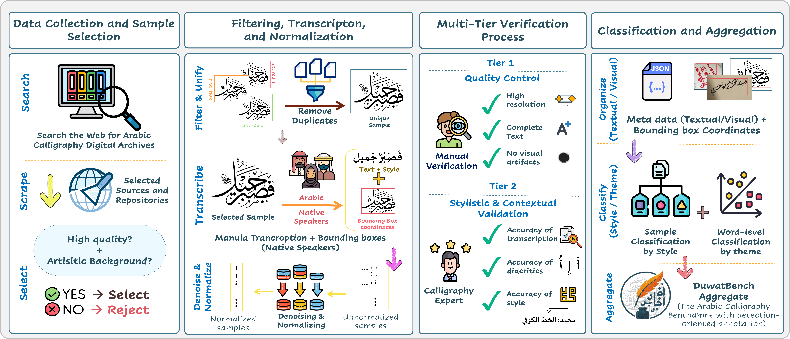
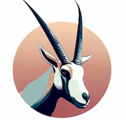
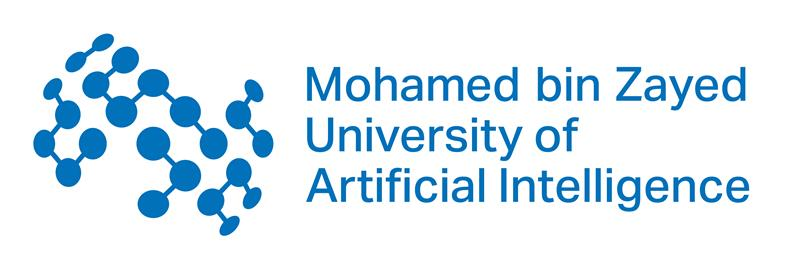

 
 <div style="margin-top:50px;">
      <h1 style="font-size: 30px; margin: 0;">  DuwatBench: Bridging Language and Visual Heritage through an Arabic Calligraphy Benchmark for Multimodal Understanding [EACL 2026 🔥]</h1>
 </div>
   
   
 <div  align="center" style="margin-top:10px;"> 

<!-- <h1 align="center">DuwatBench</h1> -->
<!-- <h3 align="center">دواة:معيار الخط العربي</h3> -->

<!-- <p align="center">
  <b>Bridging Language and Visual Heritage through an Arabic Calligraphy Benchmark for Multimodal Understanding</b>
</p> -->


  [Shubham Patle](https://github.com/shubhamrpatle) <sup>1* </sup> &nbsp;
  [Sara Ghaboura](https://huggingface.co/SLMLAH) <sup>1* </sup> &nbsp;
  [Hania Tariq](https://huggingface.co/) <sup>2 </sup> &nbsp;
  [Mohammad Usman Khan](https://huggingface.co/) <sup>3 </sup> &nbsp;
  <br>
 [Omkar Thawakar](https://omkarthawakar.github.io)  <sup>1 </sup>&nbsp;
 [Rao M. Anwer](https://scholar.google.com/citations?hl=en&user=_KlvMVoAAAAJ) <sup>1</sup>&nbsp;
 [Salman Khan](https://scholar.google.com/citations?hl=en&user=M59O9lkAAAAJ) <sup>1,4 </sup>
  <br>
  <br>  

<p align="center">
  <sup>1</sup>Mohamed bin Zayed University of AI &nbsp;&nbsp;
  <sup>2</sup>NUCES &nbsp;&nbsp;
  <sup>3</sup>NUST &nbsp;&nbsp;
  <sup>4</sup>Australian National University
</p>


  [](https://arxiv.org/abs/2502.14865)
  [](https://mbzuai-oryx.github.io/TimeTravel/)
  [](https://github.com/mbzuai-oryx/DuwatBench/issues)
  [](https://github.com/mbzuai-oryx/DuwatBench/stargazers)
  [](https://github.com/mbzuai-oryx/DuwatBench/blob/main/LICENSE)
  <br>
  <em> <sup> *Equal Contribution  </sup> </em>
  <br>
</div>


<p align="center">
    
</p> 

 
<div align="center">
 <b> If you like our project, please give us a star ⭐ on GitHub for the latest update. </b><br>
</div>
<br>
<p align="center">
    
</p> 
<br>
<br>

##  Latest Updates
 🔥🔥 **[04 Jan 2026]** 🔥🔥 DuwatBench accepted to EACL 2026 Main track.<br>
 🔥  **[22 Jan 2026]** DuwatBench the open-source Arabic Calligraphy Benchmark for Multimodal Understanding is released.<br>
 🤗  **[23 Jan 2026]** DuwatBench dataset available on [HuggingFace](https://huggingface.co/datasets/MBZUAI/TimeTravel).<br>

<br>

---
<br>

##  Overview

**DuwatBench** is a comprehensive benchmark for evaluating LMMs on Arabic calligraphy recognition. Arabic calligraphy represents one of the richest visual traditions of the Arabic language, blending linguistic meaning with artistic form. DuwatBench addresses the gap in evaluating how well modern AI systems can process stylized Arabic text.
<br>
<div style="display: flex; justify-content: space-between; align="center;">
    <figure style="width: 40%;">
      &emsp;&emsp;
      &emsp;&emsp;&emsp;&emsp;&emsp;&emsp;&emsp;
     
    </figure>
</div>
<br>
<h6><em>  <b>Figure 1.</b> Figure 1. Left: Proportional breakdown of calligraphic styles in the DuwatBench dataset. Right: Proportional breakdown of textual categories, covering religious and non-religious themes.
</em> 
</h6>
</p> 

---
<br>

 ## 🌟 Key Features
### **Key Features of TimeTravel**  
- **1,272 curated samples** spanning 6 classical and modern calligraphic styles
- **Over 9.5k word instances with approximately 1,475 unique words** spanning religious and cultural domains
- **Bounding box annotations** for detection-level evaluation
- **Full text transcriptions** with style and theme labels
- **Complex artistic backgrounds** preserving real-world visual complexity

---
<br>

##   DuwatBench Creation Pipeline
The DuwatBench dataset follows a structured pipeline to ensure the accuracy, completeness, and contextual richness by style and categry.<br>

<p align="center">
   
    <h6>
       <em>  <b>Figure 2. End-to-end pipeline for constructing DuwatBench, from data collection and manual transcription with bounding boxes to multi-tier verification and style/theme aggregation.</b>  </em>
    </h6>
 
---
<br>

##  Calligraphic Styles


| Style | Arabic | Description |
|-------|--------|-------------|
| **Thuluth** | الثلث | Ornate script used in mosque decorations |
| **Diwani** | الديواني | Flowing Ottoman court script |
| **Naskh** | النسخ | Standard readable script |
| **Kufic** | الكوفي | Geometric angular early Arabic script |
| **Ruq'ah** | الرقعة| Modern everyday handwriting |
| **Nasta'liq** | النستعليق| Persian-influenced flowing script |

---
<br>

## 🧐 DuwatBench Dataset Examples

<p align="center">
   
    <h6>
       <em>  <b>Figure 2. End-to-end pipeline for constructing DuwatBench, from data collection and manual transcription with bounding boxes to multi-tier verification and style/theme aggregation.</b>  </em>
    </h6>

---
<br>

##  Installation

### Requirements

- Python 3.10+
- CUDA-compatible GPU (recommended for open-source models)

### Setup

```bash
# Clone the repository
git clone https://github.com/mbzuai-oryx/DuwatBench.git
cd DuwatBench

# Create virtual environment
python -m venv venv
source venv/bin/activate  # Linux/Mac
# or: venv\Scripts\activate  # Windows

# Install dependencies
pip install -r requirements.txt
```

### API Keys Configuration

For closed-source models, set your API keys:

```bash
# Option 1: Environment variables
export GEMINI_API_KEY="your-key"
export OPENAI_API_KEY="your-key"
export ANTHROPIC_API_KEY="your-key"

# Option 2: Create config file
cp src/config/api_keys.example.py src/config/api_keys.py
# Edit api_keys.py with your keys
```
---
<br>


##  Dataset

### Download

```bash
# Download from Hugging Face
huggingface-cli download MBZUAI/DuwatBench --local-dir ./data

# Or use Python
from datasets import load_dataset
dataset = load_dataset("MBZUAI/DuwatBench")
```

### Data Format

Each sample in the JSON manifest contains:

```json
{
  "image_id": "images/2_129.jpg",
  "Style": "Thuluth",
  "Text": ["صَدَقَ اللَّهُ الْعَظِيمُ"],
  "word_count": [3],
  "total_words": 3,
  "bboxes": [[34, 336, 900, 312]],
  "Category": "quranic"
}
```

---
<br>

##  Evaluation (Quick Start)

```bash
# Evaluate a single model
python src/evaluate.py --model gemini-2.5-flash --mode full_image

# Evaluate with bounding boxes
python src/evaluate.py --model gpt-4o-mini --mode with_bbox

# Evaluate both modes
python src/evaluate.py --model EasyOCR --mode both

# Resume interrupted evaluation
python src/evaluate.py --model claude-sonnet-4.5 --mode full_image --resume
```

---
<br>
 
##  🎯 Quantitative Evaluation and Results

### Evaluation Metrics

| Metric | Description |
|--------|-------------|
| **CER** | Character Error Rate - edit distance at character level |
| **WER** | Word Error Rate - edit distance at word level |
| **chrF** | Character n-gram F-score - partial match robustness |
| **ExactMatch** | Strict full-sequence accuracy |
| **NLD** | Normalized Levenshtein Distance - balanced error measure |


### Open-Source Models 
| Model | CER ↓ | WER ↓ | chrF ↑ | ExactMatch ↑ | NLD ↓ |
|-------|-------|-------|--------|--------------|-------|
| MBZUAI/AIN* | 0.5494 | 0.6912 | 42.67 | 0.1895 | 0.5134 |
| Gemma-3-27B-IT | 0.5556 | 0.6591 | 51.53 | 0.2398 | 0.4741 |
| Qwen2.5-VL-72B | 0.5709 | 0.7039 | 43.98 | 0.1761 | 0.5298 |
| Qwen2.5-VL-7B | 0.6453 | 0.7768 | 36.97 | 0.1211 | 0.5984 |
| InternVL3-8B | 0.7588 | 0.8822 | 21.75 | 0.0574 | 0.7132 |
| EasyOCR | 0.8538 | 0.9895 | 12.30 | 0.0031 | 0.8163 |
| TrOCR-Arabic* | 0.9728 | 0.9998 | 1.79 | 0.0000 | 0.9632 |
| LLaVA-v1.6-Mistral-7B | 0.9932 | 0.9998 | 9.16 | 0.0000 | 0.9114 |

### Closed-Source Models
| Model | CER ↓ | WER ↓ | chrF ↑ | ExactMatch ↑ | NLD ↓ |
|-------|-------|-------|--------|--------------|-------|
| **Gemini-2.5-flash** | **0.3700** | **0.4478** | **71.82** | **0.4167** | **0.3166** |
| Gemini-1.5-flash | 0.3933 | 0.5112 | 63.28 | 0.3522 | 0.3659 |
| GPT-4o | 0.4766 | 0.5692 | 56.85 | 0.3388 | 0.4245 |
| GPT-4o-mini | 0.6039 | 0.7077 | 42.67 | 0.2115 | 0.5351 |
| Claude-Sonnet-4.5 | 0.6494 | 0.7255 | 42.97 | 0.2225 | 0.5599 |

<em> *\* Arabic-specific models* </em>

### Per-Style WER Performance (Full Image)

| Model | Kufic | Thuluth | Diwani | Naskh | Ruq'ah | Nasta'liq |
|-------|-------|---------|--------|-------|--------|-----------|
| Gemini-2.5-flash | 0.7067 | 0.3527 | 0.5698 | 0.4765 | 0.5817 | 0.5222 |
| Gemini-1.5-flash | 0.7212 | 0.4741 | 0.5783 | 0.4444 | 0.5445 | 0.5023 |
| GPT-4o | 0.8041 | 0.5540 | 0.6370 | 0.4189 | 0.5507 | 0.4434 |
| Gemma-3-27B-IT | 0.7802 | 0.6315 | 0.7326 | 0.5138 | 0.7571 | 0.6637 |
| MBZUAI/AIN | 0.7916 | 0.7036 | 0.7130 | 0.5367 | 0.6111 | 0.6916 

### Key Findings

- **Gemini-2.5-flash** achieves the best overall performance with 41.67% exact match accuracy
- Models perform best on **Naskh** and **Ruq'ah** (standardized strokes)
- **Diwani** and **Thuluth** (ornate scripts with dense ligatures) remain challenging
- **Kufic** records the lowest scores due to geometric rigidity
- Bounding box localization improves performance across most models

---
<br>


##   Qulaitative Evaluation and Results

<p align="center">
   
    <h6>
       <em>  <b>Figure 3. Qualitative results comparing open- and closed-source models on DuwatBench calligraphy samples.</b>  </em>
    </h6>


---
<br>


##  Project Structure

```
DuwatBench/
├── README.md
├── requirements.txt
├── setup.py
├── LICENSE
├── CITATION.cff
├── data/
│   ├── images/                   # Calligraphy images
│   └── duwatbench.json           # Dataset manifest
├── src/
│   ├── evaluate.py               # Main evaluation script
│   ├── models/
│   │   └── model_wrapper.py      # Model implementations
│   ├── metrics/
│   │   └── evaluation_metrics.py # CER, WER, chrF, etc.
│   ├── utils/
│   │   ├── data_loader.py        # Dataset loading
│   │   └── arabic_normalization.py
│   └── config/
│       ├── eval_config.py
│       └── api_keys.example.py
├── scripts/
│   ├── download_data.sh
│   └── run_all_evaluations.sh
└── results/                      # Evaluation outputs
```

---
<br>

## 📚 Citation

If you use DuwatBench dataset in your research, please consider citing:


```bibtex
@article{duwatbench2025,
  title={DuwatBench: Bridging Language and Visual Heritage through an
         Arabic Calligraphy Benchmark for Multimodal Understanding},
  author={Patle, Shubham and Ghaboura, Sara and Tariq, Hania and
          Khan, Mohammad Usman and Thawakar, Omkar and
          Anwer, Rao Muhammad and Khan, Salman},
  journal={arXiv preprint arXiv:XXXX.XXXXX},
  year={2025}
}
```

---
<br>

## ⚖️ License

This project is licensed under the Apache License 2.0 - see the [LICENSE](LICENSE) file for details.

The dataset images are sourced from public digital archives and community repositories under their respective licenses.

---
<br>

##  Acknowledgments

- Digital archives: [Library of Congress](https://www.loc.gov/collections/), [NYPL Digital Collections](https://digitalcollections.nypl.org/)
- Community repositories: [Calligraphy Qalam](https://calligraphyqalam.com/), [Free Islamic Calligraphy](https://freeislamiccalligraphy.com/), [Pinterest](https://www.pinterest.com/)
- Annotation tool: [MakeSense.ai](https://www.makesense.ai/)
- Arabic NLP tools: [CAMeL Tools](https://github.com/CAMeL-Lab/camel_tools)

---
<br>

##  Contact

For questions or issues, please:
- Open an issue on [GitHub](https://github.com/mbzuai-oryx/DuwatBench/issues)
- Contact the authors at: {shubham.patle, sara.ghaboura, omkar.thawakar}@mbzuai.ac.ae


---

<p align="center">
   
   
   
</p>
